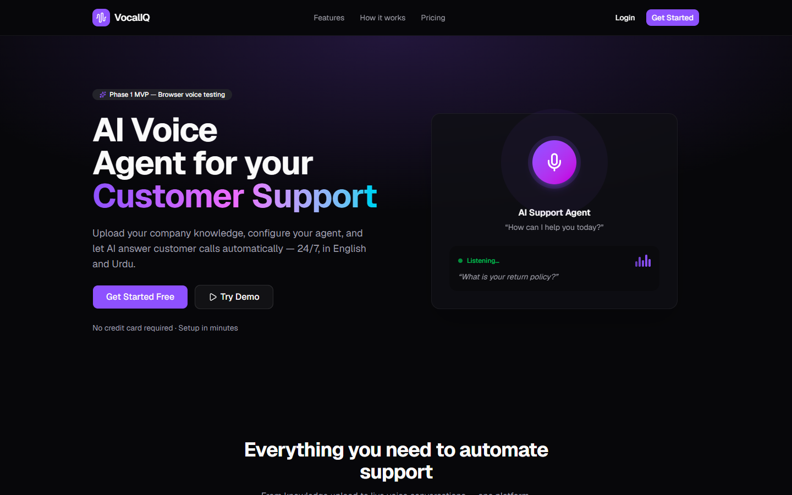
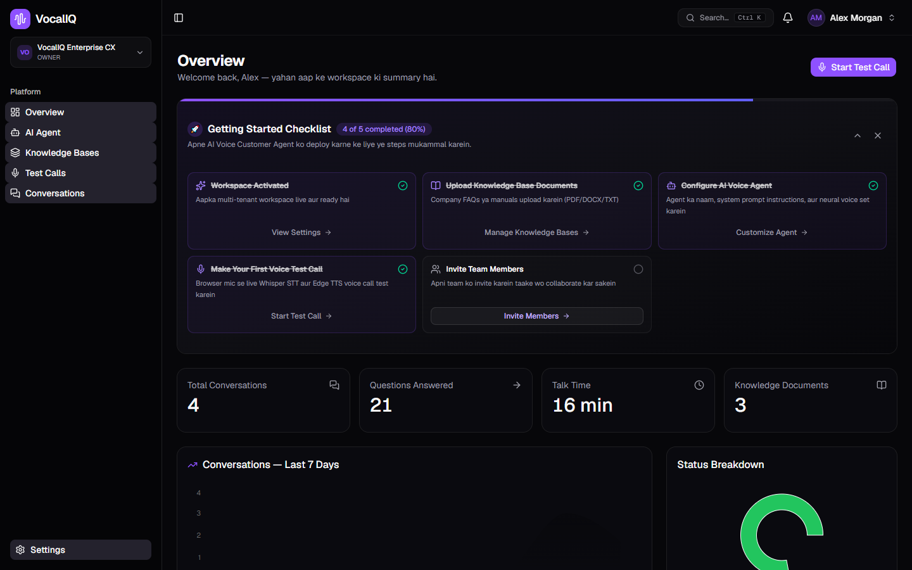
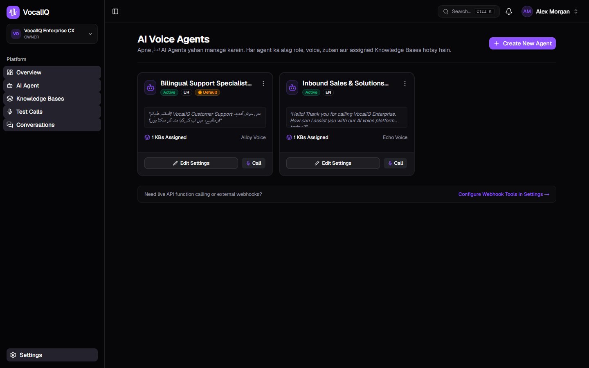
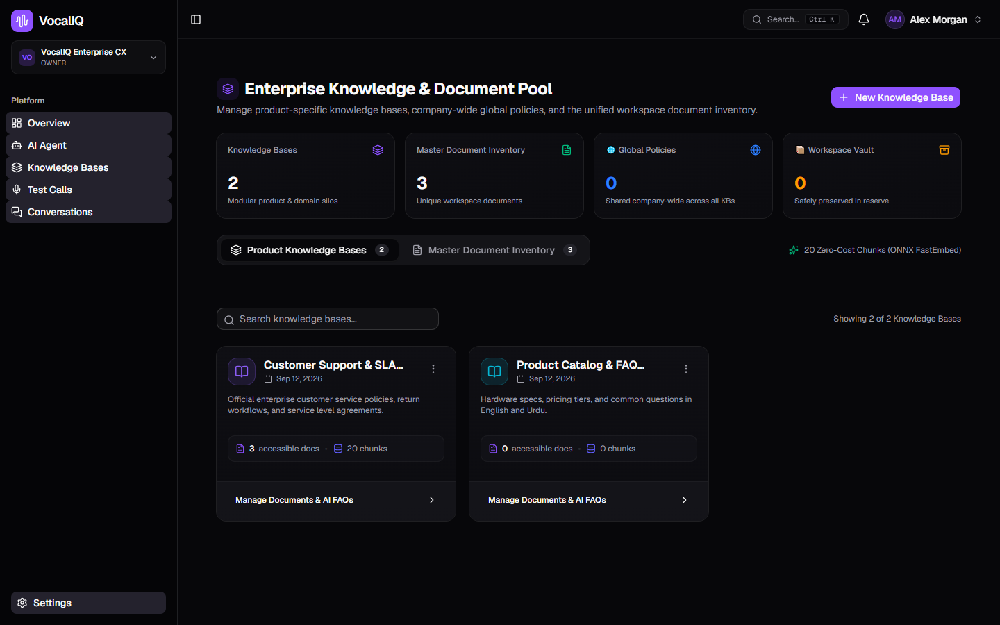
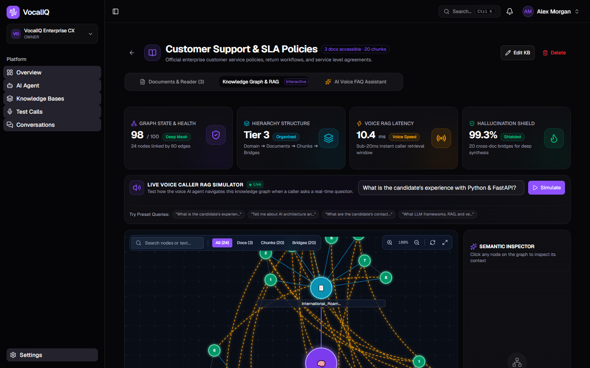
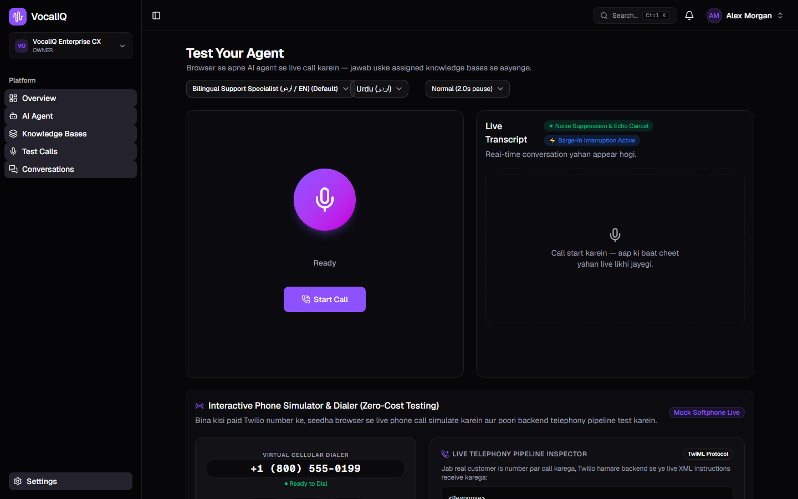
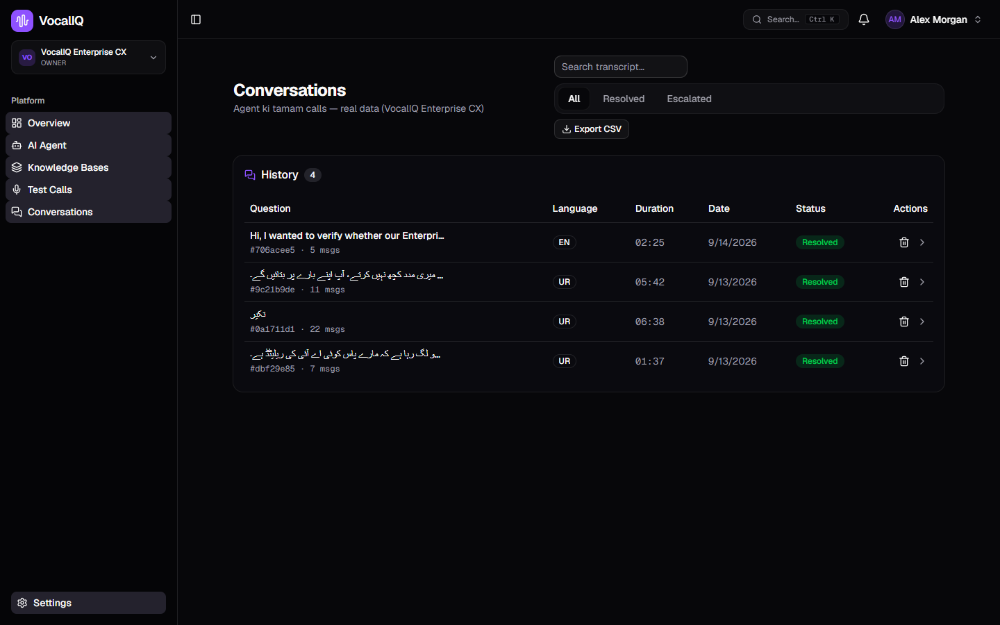
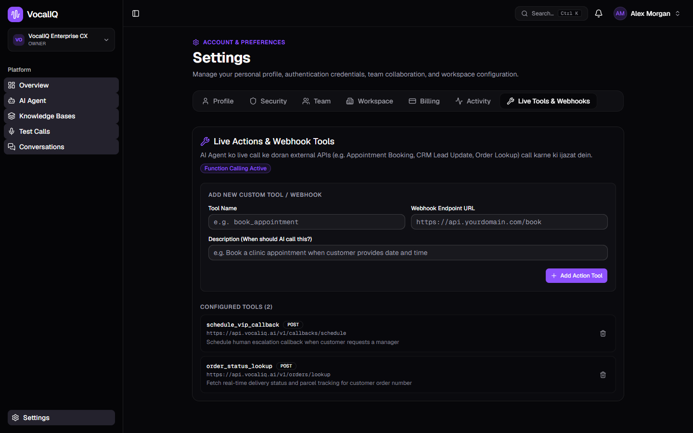

# VocalIQ — AI Voice Customer Experience Platform

> **Real-Time Bilingual Voice AI • Multi-Agent Workflows • Knowledge-Grounded Conversations**

A concise professional overview of the project, architecture, current implementation, and portfolio showcase.

---

## Overview

**VocalIQ** is an enterprise-grade AI voice customer experience platform designed for natural, ultra-low-latency conversations directly inside web browsers and telephony pipelines. Built with real-time audio streaming, dynamic voice activity detection (VAD), and instant barge-in interruption capabilities, VocalIQ enables organizations to deploy specialized AI Voice Agents grounded in private company knowledge bases.

The system features native bilingual support for Pakistani Urdu and English, dynamic Knowledge Graph (Graph RAG) visual exploration, full call transcription and analytics, multi-tenant workspace management, and webhook/tool configuration for external systems.

---

## Current Features

The following capabilities are actively implemented in the platform:

- **Real-Time Browser Voice Interaction**: Direct browser microphone streaming with sub-second voice turnaround and live audio state indicators (Ready, Listening, Thinking, Speaking).
- **Full-Duplex Audio Handling**: Bi-directional audio pipeline powered by the Web Audio API, enabling continuous audio input analysis simultaneously with audio playback.
- **Voice Activity Detection & Barge-in Interruption**: Real-time microphone energy monitoring that instantly cuts off synthesized agent speech the moment the caller starts speaking.
- **Bilingual Speech & Localization (Urdu & English)**: Native phonetic synthesis (`ur-PK` neural voices) and Whisper prompting optimized for Pakistani Urdu, acronym transliteration, and conversational English.
- **Multi-Agent Campaign & Persona Studio**: Create, edit, and manage multiple distinct voice agent personas within a workspace, configuring role presets, prompt instructions, language, and assigned voices.
- **Agent-Specific Knowledge Base Scoping**: Strict isolation ensuring each AI agent only retrieves answers from assigned knowledge domains, preventing cross-domain hallucinations.
- **Knowledge Base & Document Inventory Management**: Upload, parse, chunk, and index corporate documents (PDF, DOCX, TXT), tracking chunk counts and indexing states.
- **Interactive Knowledge Graph & RAG Visualization**: Visual Graph RAG explorer rendering hierarchical semantic networks (domains, documents, chunks, and cross-document bridge connections) with real-time traversal telemetry and hallucination metrics.
- **Conversation Transcripts & History**: Persistent storage and search of call sessions, complete turn-by-turn bilingual transcripts, duration tracking, and resolution status tagging.
- **SaaS Workspace Dashboard**: Multi-tenant workspace overview displaying real-time analytics, 7-day conversation trends, onboarding checklists, and usage metrics.
- **Webhook & Tool Configuration Interface**: Declarative tool definition UI allowing operators to specify custom external webhook endpoints, HTTP methods, and JSON parameters (*clearly marked as configuration & simulation mode*).

---

## Technology

VocalIQ is built with a modern, full-stack enterprise architecture:

- **Frontend & UI**:
  - **Next.js 16** (App Router, Turbopack)
  - **React 19**
  - **TypeScript 5**
  - **Tailwind CSS v4**
  - **Radix UI & Lucide Icons**
  - **Recharts** (Interactive analytics charts)
- **Audio & Streaming**:
  - **Web Audio API** (AudioContext, AnalyserNode for audio frequency analysis and barge-in VAD)
  - **MediaRecorder API** (Real-time audio chunking)
  - **WebRTC & Streaming Protocols**
- **Backend & Services Architecture**:
  - **FastAPI** (Python 3.12 asynchronous AI microservice for STT, LLM orchestration, RAG retrieval, and TTS streaming)
  - **NestJS** (Node.js microservice for workspace management, authentication, and team administration)
- **Data & Vector Storage**:
  - **PostgreSQL with pgvector** (Relational schemas, vector embeddings, and chunk indexing hosted via Supabase)
  - **ONNX FastEmbed & Local Embeddings**
- **Speech & Language Models**:
  - **Groq Whisper-Turbo** / Speech-to-Text streaming
  - **Edge Neural TTS & OpenAI Speech Services**

---

## Architecture

```text
┌─────────────────────────────────────────────────────────────────────────────────┐
│                                CLIENT / BROWSER                                 │
│  Next.js 16 (React 19) • Web Audio API Analyser • Full-Duplex WebRTC Streaming   │
└────────┬───────────────────────────────┬────────────────────────────────┬───────┘
         │ (1) Live Microphone Audio     │ (4) Synthetic TTS Audio Stream │
         ▼                               ▲                                │
┌──────────────────────────────────────────────────────────────────┐      │
│                PROPRIETARY AI VOICE BACKEND (FASTAPI)            │      │
│  ┌────────────────────────┐      ┌─────────────────────────────┐ │      │
│  │ Streaming STT Pipeline │      │ Neural Edge TTS Synthesizer │ │      │
│  │ (Groq Whisper-Turbo /  │      │ (Bilingual Urdu/English     │ │      │
│  │  Custom VAD Cutoff)    │      │  Phonetic Mapping)          │ │      │
│  └───────────┬────────────┘      └──────────────▲──────────────┘ │      │
│              ▼                                  │                │      │
│  ┌──────────────────────────────────────────────┴──────────────┐ │      │
│  │           Conversational Agent Graph Orchestrator            │ │      │
│  │   • Multi-Turn Context Tracking • Active Interruption VAD    │ │      │
│  │   • Live Webhook / CRM Function Calling Dispatcher          │ │      │
│  └───────────┬──────────────────────────────────▲──────────────┘ │      │
│              ▼                                  │                │      │
│  ┌──────────────────────────────────────────────┴──────────────┐ │      │
│  │             Hybrid Vector & Graph RAG Engine                │ │      │
│  │   • Multi-Doc Semantic Bridges • ONNX Hierarchical Chunking │ │      │
│  └───────────────────────────┬─────────────────────────────────┘ │      │
└──────────────────────────────┼───────────────────────────────────┘      │
                               ▼                                          │
┌──────────────────────────────────────────────────────────────────┐      │
│                 DATA & INFRASTRUCTURE LAYER                      │      │
│  PostgreSQL (Supabase + pgvector) • Auth Service (NestJS JWT)    │◄─────┘
└──────────────────────────────────────────────────────────────────┘
```

> **Repository Structure Note**: This repository contains the complete frontend client application, UI components, audio streaming hooks, and client-side RAG visualizers. Backend AI orchestration services, proprietary speech pipelines, and internal authentication microservices connect via secure REST and streaming API interfaces.

---

## Portfolio Screenshots

### 1. Landing Page
*Clean, modern landing page presenting the VocalIQ platform value proposition and voice demo capabilities.*



---

### 2. Workspace Dashboard Overview
*SaaS workspace metrics highlighting call volume, questions answered, talk duration, 7-day trend analysis, and onboarding progress.*



---

### 3. Multi-Agent Studio
*Configure specialized AI personas (e.g., Bilingual Support Specialist and Inbound Sales Specialist) with dedicated voices, languages, and scoped knowledge bases.*



---

### 4. Knowledge Base & Document Inventory
*Manage isolated knowledge domains, document vaults, and chunk distribution with instant vector indexing.*



---

### 5. Knowledge Graph & RAG Visualization
*Interactive Graph RAG visualizer showing entity relationships, document clusters, cross-document semantic bridges, and retrieval latency metrics.*



---

### 6. Live Browser Voice Call Screen
*Full-duplex voice testing console featuring real-time audio orb indicators, barge-in interruption detection, and a virtual cellular softphone dialer.*



---

### 7. Conversation History & Bilingual Transcripts
*Call session logging with searchable bilingual Urdu and English transcripts, duration metrics, and resolution status.*



---

### 8. Webhook & Tool Management
*Declarative tool registry allowing operators to configure outbound API webhooks for CRM lookups, order tracking, and scheduling workflows.*



---

## Current Limitations

In the interest of full technical transparency:

- **Backend Dependency for Live Voice Interaction**: Full-duplex speech synthesis, streaming transcription, and vector search require active connections to the FastAPI AI service and speech provider APIs.
- **PSTN / Telephony Integration**: Carrier cellular calling is currently demonstrated via the browser softphone simulator; public carrier trunking (e.g. Twilio / SIP trunks) is architectural and not deployed in the public demo.
- **Billing & Subscriptions**: Plan tier selection and payment interfaces are structured for Stripe integration, but live transaction processing is simulated in the showcase.
- **Agentic Tools**: Custom webhook endpoints can be configured, tested, and assigned to agents; autonomous arbitrary runtime execution is sandboxed at configuration/demo level.

---

## Future Roadmap

- **Public Telephony Deployment**: Direct inbound and outbound phone number provisioning with PSTN/SIP carrier connectivity.
- **Autonomous Tool Execution**: Full multi-step agentic execution loop with automated retries, payload schema validation, and confirmation checkpoints.
- **Unified Customer CRM**: In-depth caller profile histories, customer sentiment tracking across calls, and automated lifecycle tagging.
- **Live Human Handoff**: Warm and cold call transfers to human support agents with context-preserving summaries and live whisper coaching.
- **Granular RBAC**: Role-based access control with workspace team roles (Owner, Admin, Analyst, Agent Operator).
- **Usage Limits & Quota Billing**: Real-time per-second billing meters with automatic threshold alerts and stripe metered subscriptions.
- **AI Observability & Evaluation**: LLM-as-a-judge automated call grading, hallucination detection alerts, and audio latency tracing dashboards.
