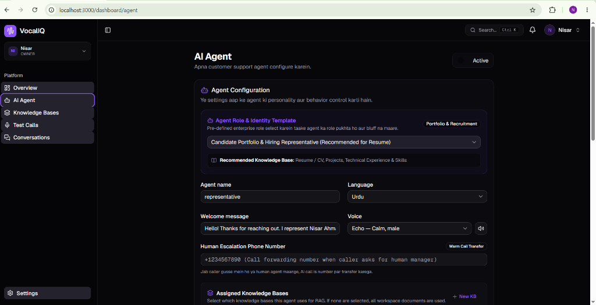
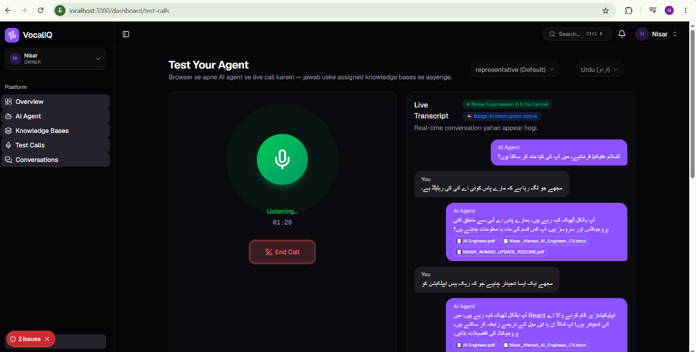
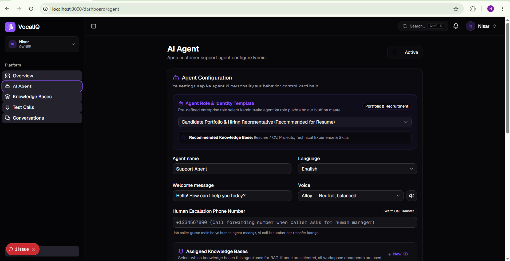
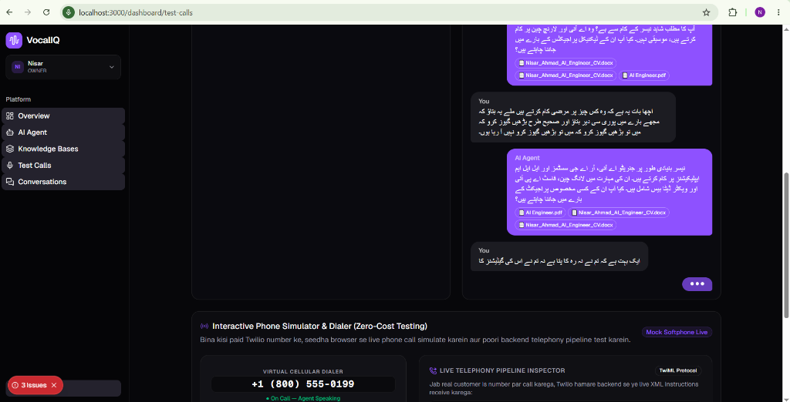

# 🎙️ VocalIQ — Enterprise Autonomous AI Voice Agent Platform


**VocalIQ** is an enterprise-grade, full-duplex conversational AI voice platform engineered for multi-campaign voice workflows, real-time voice streaming, and localized bilingual intelligence (Native Urdu & English). 

It empowers businesses and technical teams to deploy specialized AI Voice Agents capable of active human-like conversations, adaptive voice activity detection (VAD), barge-in interruption handling, and dynamic knowledge base (RAG) groundings.

---

## 📸 Product Showcases & Screenshots

### 1. Multi-Agent Campaign & Persona Studio
> *Create, customize, and switch between specialized voice agents (Candidate Hiring Representative, Inbound Sales, IT Helpdesk, Healthcare Receptionist) with scoped Knowledge Base assignments.*



---

### 2. Full-Duplex Live Voice Testing & Real-Time Transcripts
> *Interactive WebRTC voice testing environment featuring active speech detection, configurable conversational pause tolerance (1.5s - 3.0s), adaptive ambient noise filtering, and bilingual Urdu/English live transcription.*



---

### 3. Knowledge Graph Explorer & Hybrid RAG Retrieval
> *Interactive Graph RAG visualizer showing entity bridges, cross-document semantic relations, and hierarchical chunk embeddings powering zero-hallucination agent responses.*



---

### 4. Interactive Cellular Softphone & Live Telephony Pipeline
> *Zero-cost browser-based virtual phone dialer simulating carrier cellular calls with live TwiML protocol inspection and automated call persistence.*



---

## 🌟 Key Highlights & Engineering Features

### 1. 🤖 Multi-Agent Campaign Architecture
- **Multi-Tenant / Multi-Agent**: Create and manage multiple distinct AI voice personas within a single workspace.
- **Enterprise Role Presets**:
  - *Candidate Portfolio & Hiring Representative* (Interactive CV & Technical Representative)
  - *Enterprise Customer Support Specialist* (L1/L2 SLA Resolution)
  - *Technical Support & IT Helpdesk Engineer*
  - *Inbound Sales & Product Consultant*
  - *Medical Clinic Appointment Receptionist*
- **Scoped Knowledge Base Assignment**: Assign specific vector & graph knowledge bases to specific agents to eliminate hallucination and isolate company domains.

### 2. ⚡ Real-Time Full-Duplex Voice Engine
- **Sub-Second Latency Pipeline**: Seamless integration of streaming Speech-to-Text (STT), LLM reasoning, and neural Text-to-Speech (TTS).
- **Adaptive Voice Activity Detection (VAD)**: Dynamic room noise calibration preventing phantom triggers and false starts.
- **Natural Speaking Pause Buffer**: Configurable conversational pause tolerance (1.5s – 3.0s) so natural mid-sentence pauses are never cut off.
- **Barge-in Interruption**: Real-time Web Audio API energy monitoring immediately cuts off the agent's voice the millisecond the caller starts speaking.

### 3. 🌐 Dual-Voice Bilingual Localization (Urdu & English)
- **Pakistani Urdu Optimization**:
  - Native Urdu script synthesis (`ur-PK-UzmaNeural` & `ur-PK-AsadNeural`) preventing broken phonetic output.
  - Smart acronym transliteration (e.g., `RAG` $\rightarrow$ `ریگ`, `AI` $\rightarrow$ `اے آئی`, `LLM` $\rightarrow$ `ایل ایل ایم`).
  - Native Whisper prompts filtering phantom background tokens (e.g., silence `موسیقی` tokens).
- **Conversational Intelligence**: Agents practice active listening, acknowledge corrections, and proactively keep dialogue open with natural follow-ups.

### 4. 📊 Enterprise Telephony & CRM Integration
- **Zero-Cost WebRTC / Softphone Simulator**: Browser-based interactive cellular dialer simulating live telecom carriers.
- **Live Actions & Webhook Tools**: Configure outbound webhooks allowing agents to trigger live calendar bookings, CRM updates, or order lookups during phone calls.
- **Complete Call Analytics & Persistence**: Automated transcripts, call duration logging, resolution tagging, and user feedback ratings stored in PostgreSQL with pgvector.

---

## 🏗️ End-to-End System Architecture

```text
┌─────────────────────────────────────────────────────────────────────────────────┐
│                                CLIENT / BROWSER                                 │
│  Next.js 16 (React 19) • Web Audio API Analyser • Full-Duplex WebRTC Streaming   │
└────────┬───────────────────────────────┬────────────────────────────────┬───────┘
         │ (1) Live Microphone Audio     │ (4) Synthetic TTS Audio Stream │
         ▼                               ▲                                │
┌──────────────────────────────────────────────────────────────────┐      │
│                PROPRIETARY AI VOICE BACKEND (FASTAPI)            │      │
│  ┌────────────────────────┐      ┌─────────────────────────────┐ │      │
│  │ Streaming STT Pipeline │      │ Neural Edge TTS Synthesizer │ │      │
│  │ (Groq Whisper-Turbo /  │      │ (Bilingual Urdu/English     │ │      │
│  │  Custom VAD Cutoff)    │      │  Phonetic Mapping)          │ │      │
│  └───────────┬────────────┘      └──────────────▲──────────────┘ │      │
│              ▼                                  │                │      │
│  ┌──────────────────────────────────────────────┴──────────────┐ │      │
│  │           Conversational Agent Graph Orchestrator            │ │      │
│  │   • Multi-Turn Context Tracking • Active Interruption VAD    │ │      │
│  │   • Live Webhook / CRM Function Calling Dispatcher          │ │      │
│  └───────────┬──────────────────────────────────▲──────────────┘ │      │
│              ▼                                  │                │      │
│  ┌──────────────────────────────────────────────┴──────────────┐ │      │
│  │                   Hybrid RAG Retrieval Layer                │ │      │
│  │    • Vector Cosine Search (pgvector)                        │ │      │
│  │    • Entity Knowledge Graph (Hierarchical Chunk Relations)  │ │      │
│  └─────────────────────────────────────────────────────────────┘ │      │
└────────────────────────────────────────┬─────────────────────────┘      │
                                         │                                │
                                         ▼                                ▼
┌─────────────────────────────────────────────────────────────────────────────────┐
│                           DATABASE & AUTH INFRASTRUCTURE                        │
│   • Supabase PostgreSQL (pgvector embeddings, multi-tenant agent_configs)       │
│   • NestJS Auth Service (JWT RBAC, Organization Isolation, Webhook Management) │
└─────────────────────────────────────────────────────────────────────────────────┘
```

> [!IMPORTANT]  
> **Proprietary Backend & Architecture Notice**  
> This public repository contains the **Frontend Client Application & WebRTC Voice Interface**. The backend microservices (`ai-service` containing the proprietary Hybrid Graph RAG orchestrator, full-duplex WebSocket stream handlers, and `auth-service` multi-tenant RBAC core) represent proprietary commercial intellectual property and are hosted within private infrastructure.  
> 
> Technical architecture reviews, end-to-end API specifications, or live production demonstrations can be provided upon direct request for verified portfolio evaluation or hiring inquiries.

---

## 🛠️ Technology Stack

| Layer | Technologies |
| :--- | :--- |
| **Frontend Framework** | [Next.js 16](https://nextjs.org/) (App Router, Server Actions, React 19) |
| **Language** | [TypeScript](https://www.typescriptlang.org/) (Strict Mode) |
| **Styling & Design System** | [Tailwind CSS v4](https://tailwindcss.com/), Radix UI Primitives, Lucide Icons |
| **State & Data Fetching** | React Hooks, Context API, Sonner Toasts |
| **Audio Processing** | Web Audio API (AnalyserNode, FFT time-domain RMS tracking, MediaStream) |
| **Speech-to-Text (STT)** | Groq Cloud Whisper-large-v3-turbo / Local faster-whisper |
| **Text-to-Speech (TTS)** | Microsoft Edge Neural Voice Engine (Dual English & Urdu profiles) |
| **Backend Integration** | Python FastAPI (RAG & Graph Engine), NestJS (Auth & Multi-tenancy) |

---

## 📁 Repository Structure

```text
├── public/
│   ├── screenshots/            # High-resolution platform UI showcases
│   └── icons & svgs
├── src/
│   ├── app/
│   │   ├── (auth)/             # Authentication (Login, Signup, Reset Password)
│   │   ├── admin/              # Superadmin portal (Users, Workspaces, Announcements)
│   │   ├── dashboard/
│   │   │   ├── agent/          # Multi-Agent Management (CRUD, Role Presets, KBs)
│   │   │   ├── conversations/  # Past call recordings, transcripts & analytics
│   │   │   ├── knowledge-bases/# Document vector indexing & graph RAG explorer
│   │   │   ├── test-calls/     # Full-duplex interactive voice test suite & dialer
│   │   │   ├── settings/       # Organization settings & Live Webhook tools
│   │   │   └── page.tsx        # Dashboard metrics overview
│   │   ├── layout.tsx          # Root layout & providers
│   │   └── page.tsx            # High-conversion product landing page
│   ├── components/
│   │   ├── dashboard/          # AppSidebar, SiteHeader, Greeting, Onboarding
│   │   ├── knowledge/          # Interactive Knowledge Graph Visualizer & RAG Chat
│   │   ├── landing/            # Hero, Features, Pricing, How It Works
│   │   ├── settings/           # Team, Billing, Activity, Webhook management
│   │   └── ui/                 # Reusable Radix UI design system components
│   ├── hooks/
│   │   ├── use-voice-call-v2.ts# Core full-duplex WebRTC/VAD audio engine hook
│   │   └── use-mobile.ts       # Responsive viewport hook
│   └── lib/
│       ├── ai-client.ts        # Typed API client for Agent & RAG endpoints
│       ├── api-client.ts       # Authenticated HTTP interceptor
│       └── tools-client.ts     # Webhook CRM actions client
├── package.json
└── tsconfig.json
```

---

## 🚀 Quick Start & Local Setup

### 1. Prerequisites
- **Node.js**: v18.18.0 or higher
- **Package Manager**: `npm`, `yarn`, or `pnpm`

### 2. Installation
Clone the repository and install dependencies:

```bash
git clone https://github.com/nisarahmad78/VOCALIQ.git
cd VOCALIQ
npm install
```

### 3. Environment Configuration
Create a `.env.local` file in the root directory:

```env
NEXT_PUBLIC_APP_URL=http://localhost:3000
NEXT_PUBLIC_AUTH_API_URL=http://localhost:3001
NEXT_PUBLIC_AI_API_URL=http://localhost:8000
```

### 4. Run Development Server
```bash
npm run dev
```

Open [http://localhost:3000](http://localhost:3000) with your browser.

---

## 🧪 E2E Testing & Quality Assurance

Run Playwright end-to-end test suites:

```bash
# Run all end-to-end tests
npm run test:e2e

# Run TypeScript type validation
npx tsc --noEmit
```

---

## 👨‍💻 Author & Contact

**Nisar Ahmad**  
*AI Systems & Full-Stack Engineer*  
- **GitHub**: [@nisarahmad78](https://github.com/nisarahmad78)  
- **Expertise**: Conversational Voice Agents, Full-Duplex WebRTC, RAG Systems, Distributed AI Pipelines

---

## 📄 License
This project is open-source and available under the [MIT License](LICENSE).
